# E-Commerce Cross-Platform Application (Expo)

A lightweight, high-performance, and cross-platform e-commerce application built using **Expo**. This project leverages modern React Native optimizations to deliver a fluid, native experience on iOS and Android while compiling seamlessly into a responsive layout for the Web.

---

## 1. Project Setup Instructions

Follow these instructions to get your local environment configured and the application running.

### Prerequisites

- **Node.js**: Version 22.x or higher
- **npm**: Version 9.x or higher
- **Expo Go**: Installed on an iOS/Android device, or an active simulator.

### Installation & Execution

```bash
# Clone the repository
git clone <repository-url>
cd ecommerce-app

# Install dependencies cleanly
npm install

# Run on iOS Simulator
npm run ios

# Run on Android Emulator
npm run android

# Run on Web (Compiles responsive layout)
npm run web

# Run Unit & Integration Test Suite
npm test
```

---

## 2. Project Overview

### Description

This application was engineered to address the critical requirement of unified deployment across iOS, Android, and Web platforms using **Expo**. To keep the application lightning-fast and maintain a minimal bundle size, it employs a **Lightweight Feature-Layered Architecture**.

### Data Source Notice

> ⚠️ **Note on Data Ingestion**: The initially provided external Mock API endpoint was expired. To guarantee absolute runtime stability, data integrity, and uninterrupted offline testing, a local production-ready data layer (`src/services/mockData.ts`) was implemented. This file models real-world API responses with rich descriptions, price data, categories, and high-quality image paths.

### Key Features Implemented

- **Cross-Platform Parity**: Identical business logic and synchronized styling across Mobile viewports and Web browsers.
- **Persistent Cache Loading**: Data persists on-device to survive closures and application reboots.
- **Proactive Offline Guard**: Network status monitoring that dynamically reacts to dropping connections.
- **60FPS List Velocity**: Zero-lag image and text rendering under rapid scrolling conditions.

---

## 3. Technical Decisions & Architecture

### Architecture Choice: Horizontal Layered Architecture (Layered-by-Technical-Concern)

Given the requirement to keep the application ultra-lightweight while supporting iOS, Android, and Web platforms, I implemented a **Horizontal Layered Architecture**. Instead of using bloated, deeply-nested modular frameworks, the codebase is organized flatly by technical responsibility:

- **Routing Layer (`src/app`):** Leverages Expo Router's file-based routing to manage the native view hierarchy (`Drawer` wrapping a nested `Tab` template) seamlessly across mobile and web.
- **Presentation Layer (`src/components`):** Reusable, stateless UI blocks designed to remain pure and platform-agnostic.
- **Business Logic & Data Layer (`src/store`, `src/hooks`, `src/services`):** Centralized state management and data fetching utilities decoupled entirely from the UI.

This approach keeps dependency graphs shallow, reduces initial bundle sizes, and allows Expo to optimize tree-shaking and code-splitting highly efficiently for Web targets.

### State Management & Persistence Strategy

- **TanStack Query (v5) with Local Persistence**: Server data synchronization is managed entirely via TanStack Query. To achieve offline reliability, it is wrapped inside a `PersistQueryClientProvider` hooked directly to `AsyncStorage`. Product arrays are safely snapshotted on disk, providing instantaneous startup times even with cellular connectivity fully disabled.
- **Zustand Client UI Stores**: Local operations (Cart additions, quantitative counters, and explicit Favorites arrays) use independent, lightweight Zustand slices. Selector extraction prevents unnecessary child component updates.

### Performance Considerations

- **Shopify FlashList**: Standard React Native `FlatList` structures suffer from layout calculation overhead. I integrated Shopify's **FlashList**, which recycles native cell containers instead of re-instantiating layout objects during fast scrolls.
- **Component Memoization (`React.memo`)**: Core presentation items like `ProductCard` are strictly memoized using granular prop-equality verifications. A card layout will _only_ re-render if its core primitive values change, preventing parent layout updates from degrading rendering efficiency.
- **Network Awareness via NetInfo**: Integrated `@react-native-community/netinfo` to capture network drops at the infrastructure level. The app gracefully flags connectivity losses with a lightweight banner rather than breaking loading indicators or crashing state engines.

### Testing Strategy

The codebase utilizes **Jest** and **React Native Testing Library** to validate operational stability. To prove both data integrity and UI interaction security, **two targeted high-coverage test cases** were explicitly written:

1. **Core UI Presentation Layer Test**: Verifies that the component layout structure binds data properties from the product file accurately, rendering descriptions and currency elements cleanly.
2. **Global State Integration Test**: Asserts that pressing the action triggers ("Add to Cart") passes commands to the underlying Zustand store without event-bubbling or navigation misfires.

---

## 4. Screenshots & Artifacts

### 📱 List Screen & Catalog Feed

#### Web Layout

<p align="center">
  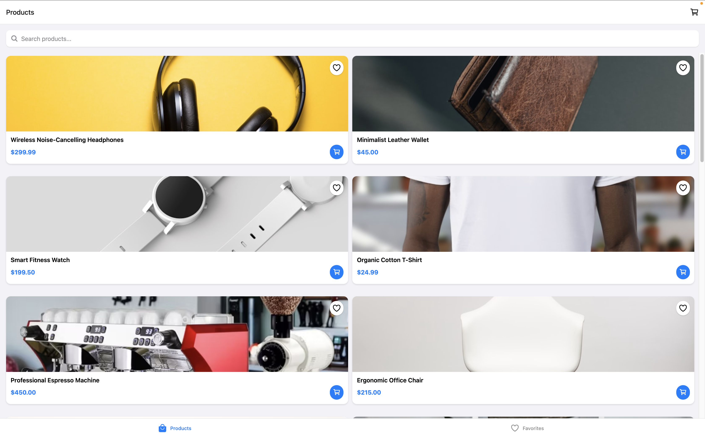
</p>

#### Mobile Layouts (Android vs. iOS)

<p align="center">
  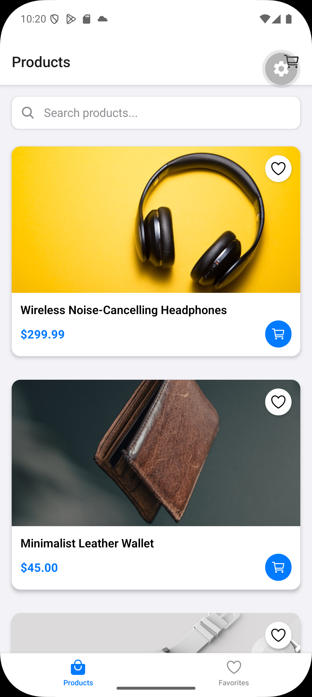
  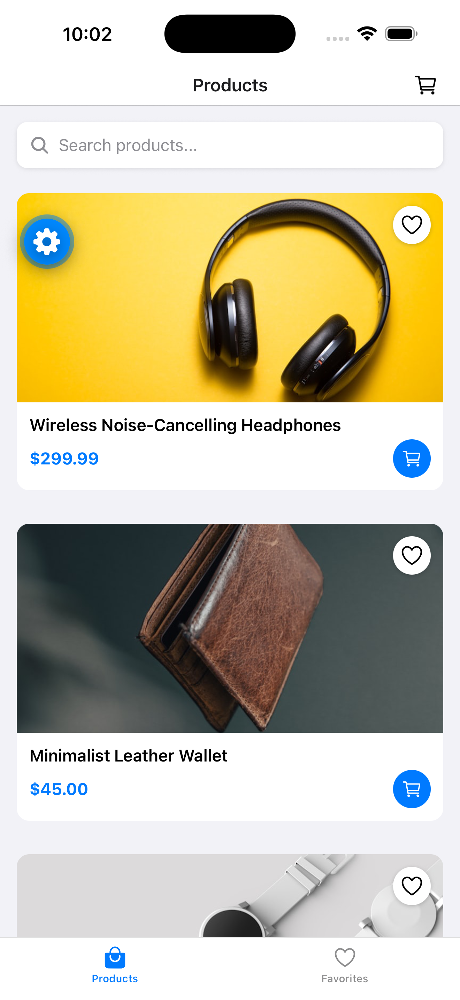
</p>

---

### 🔍 Product Details View

#### Web Layout

<p align="center">
  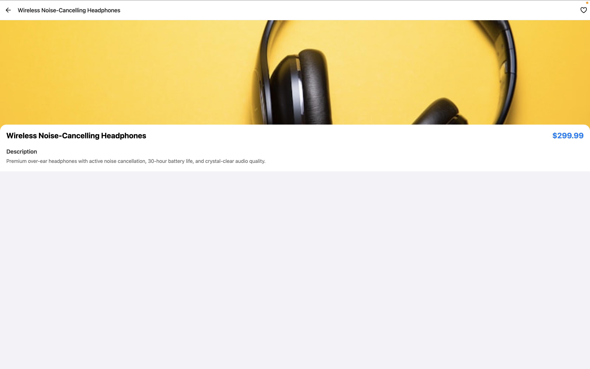
</p>

#### Mobile Layouts (Android vs. iOS)

<p align="center">
  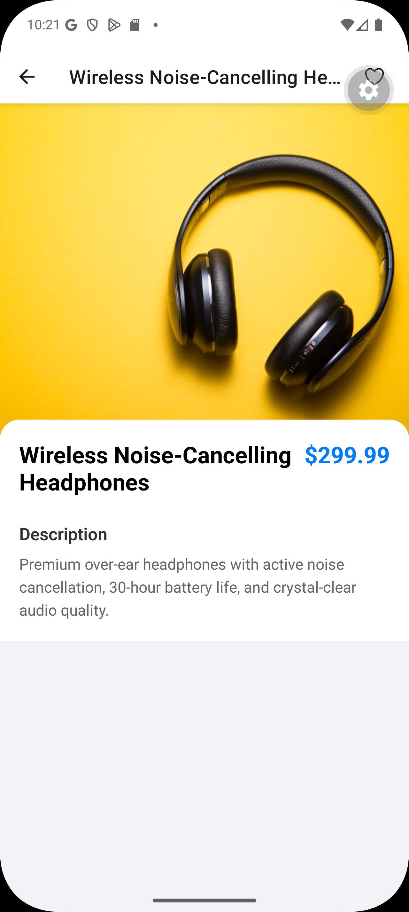
  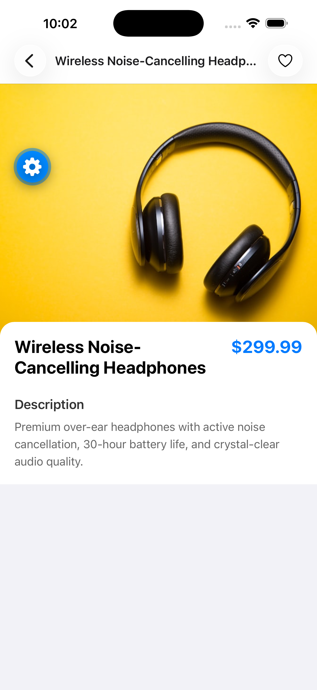
</p>

---

### ❤️ Favorites Tracking

#### Web Layout

<p align="center">
  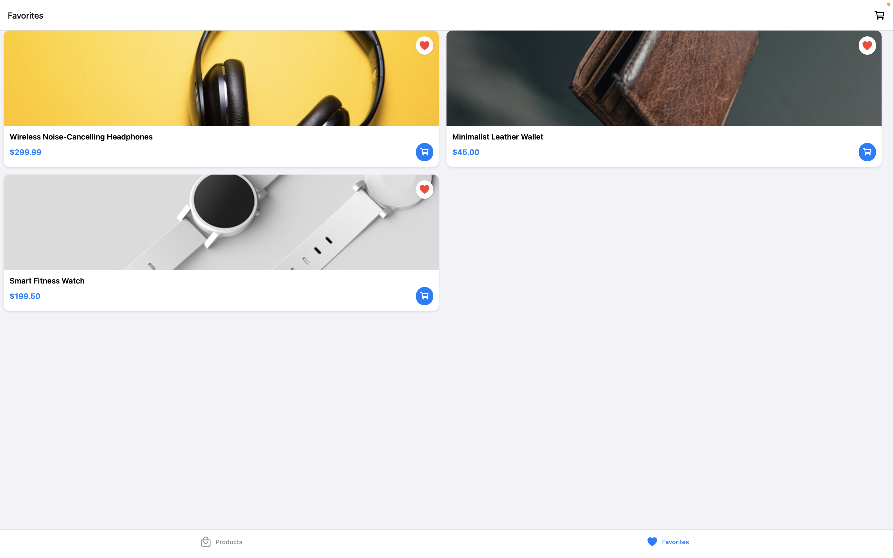
</p>

#### Mobile Layouts (Android vs. iOS)

<p align="center">
  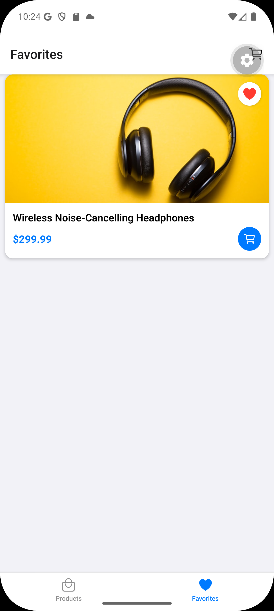
  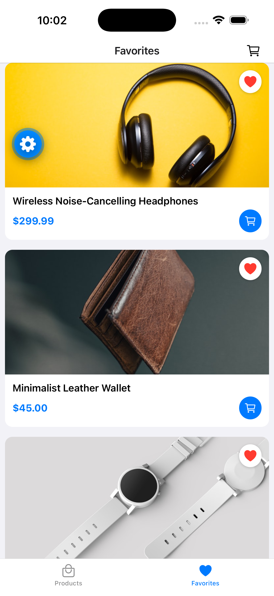
</p>

---

### 🛒 Global Cart Drawer Interface

#### Web Layout

<p align="center">
  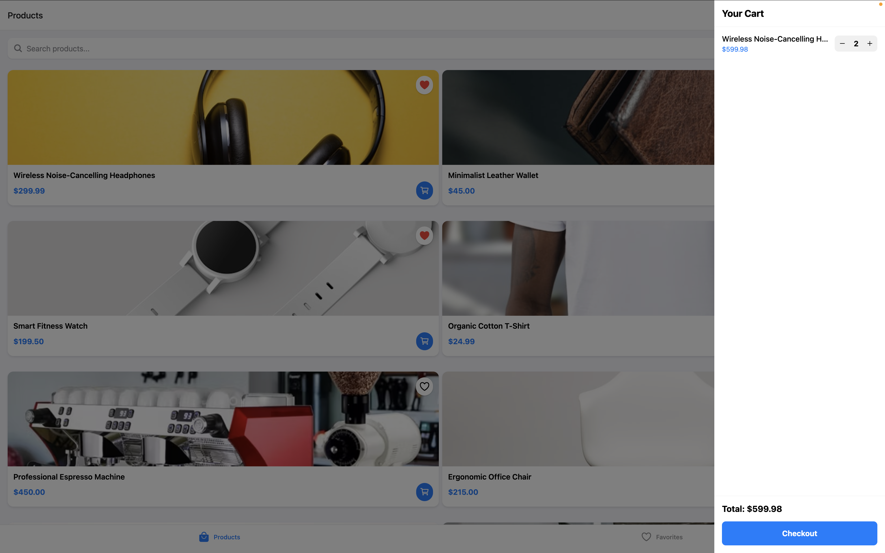
</p>

#### Mobile Layouts (Android vs. iOS)

<p align="center">
  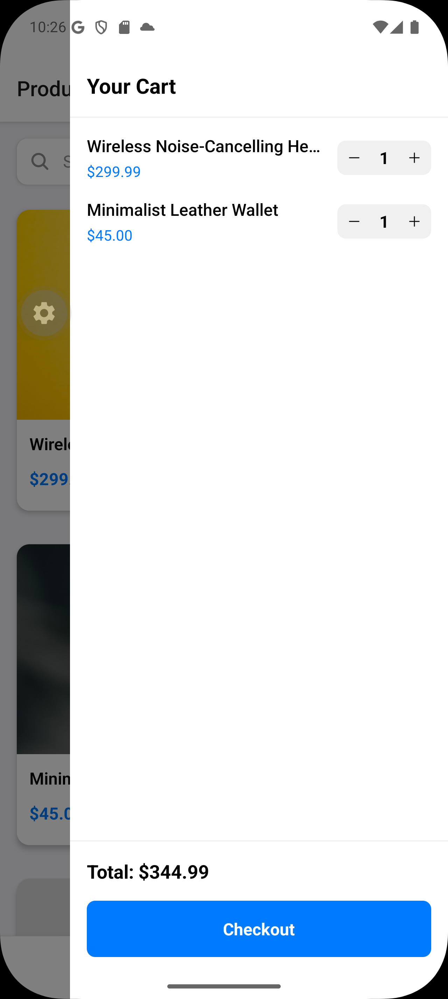
  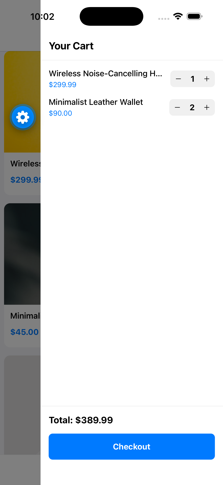
</p>
